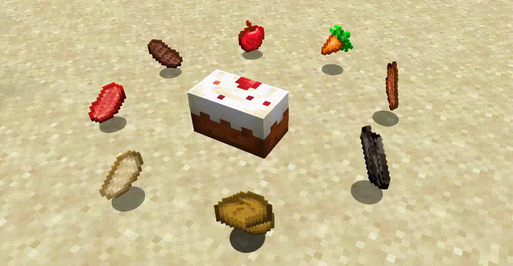

# Интерактивный мир

## Плакаты

Настенные плакаты — не обычные картины. При взаимодействии они отлетают от стены, переворачиваются и покачиваются, после чего плавно возвращаются на место. Некоторые варианты могут менять внешний вид.

## Диктофоны

Диктофоны содержат лорные аудиозаписи. Нажми ПКМ по устройству, чтобы оно поднялось с земли и начало воспроизведение.

Запись слышит только активировавший её игрок. Повторный клик во время воспроизведения не прерывает сцену.

## Фантомные предметы

Декоративные россыпи выглядят как выброшенные предметы, но их нельзя подобрать или сдвинуть блоком. Они сохраняются после перезапуска сервера и исчезают только по команде администратора.

<figure><figcaption></figcaption></figure>

## Ремонт наковален

Повреждённую наковальню можно восстановить железными слитками. Возьми слиток в основную руку и нажми **ПКМ** по наковальне. Один слиток восстанавливает одну ступень повреждения; целая наковальня железо не расходует.

## Острый камнерез

Открытая пила камнереза наносит контактный урон, если наступить на неё. Урон продолжается, пока игрок стоит непосредственно на режущем блоке.

## Кат-сцены

Серверные события могут на время перехватывать камеру и проводить игрока по заранее записанному маршруту. Во время такой сцены персонаж скрыт и защищён режимом наблюдателя, а после окончания возвращается на прежнее место. Кат-сцену можно пропустить клавишей `Shift`.
