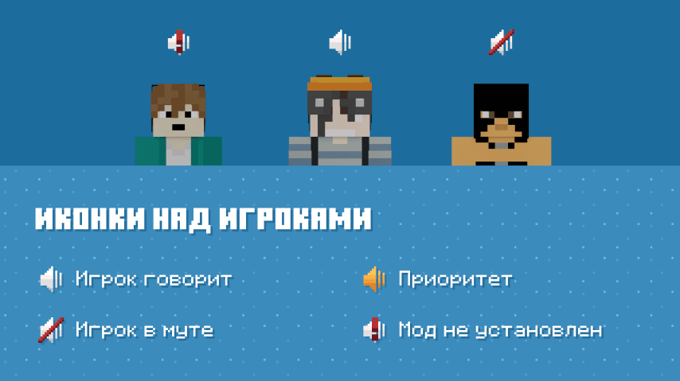
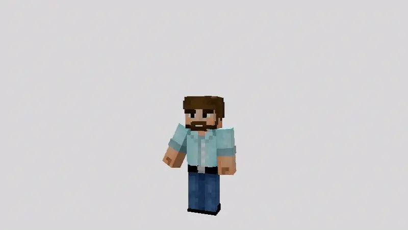

# Клиентская сборка

Сервер работает на ванильном протоколе, но для полного опыта используются клиентские моды и ресурспак.

## Обязательное

### Серверный ресурспак

Скачивается автоматически при подключении. Он содержит модели, текстуры, звуки и визуальные эффекты серверных механик.

Если автоматическая загрузка недоступна, администратор может передать архив `neutka.zip` для ручной установки.

## Рекомендуемое

### Plasmo Voice

Добавляет локальный голосовой чат. Открой меню мода назначенной клавишей, выбери микрофон и проверь уровень голоса.

<figure><figcaption></figcaption></figure>

### Emotecraft

Позволяет проигрывать анимации персонажа. Кнопка колеса эмоций настраивается в управлении Minecraft.

<figure><figcaption></figcaption></figure>

### Шейдерпак проекта

Необязательный шейдерпак для нужной визуальной атмосферы. Его можно положить в `.minecraft/shaderpacks` и включить в настройках графики. Добавляет аккуратный Bloom, Outline по границам всех сущностей и блоков без потери производительности.

## Звук диктофонов

Записи диктофонов относятся к категории **«Голос/Речь»**. Если диктофон анимируется, но молчит, проверь общую громкость и ползунок голоса в настройках звука.
