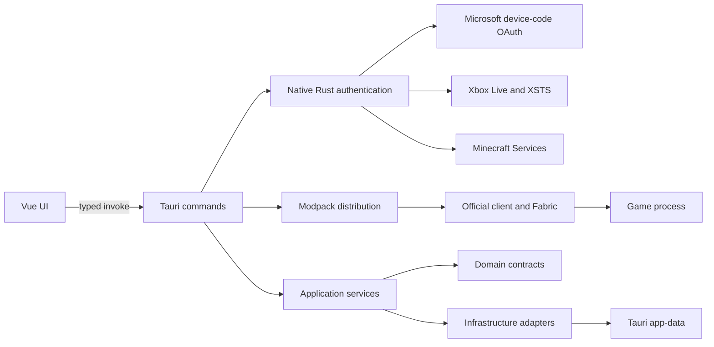

# SpringRP Launcher architecture

## Scope

A Windows-only launcher that authenticates through Microsoft, installs the
official Minecraft client with Fabric, layers the server modpack on top and
starts the game.

## Runtime shape

Tauri owns the native window through its `tao`/`wry` stack. On Windows, `wry`
hosts the Edge WebView2 runtime. The frontend is emitted by Vite into `dist/`
and embedded by Tauri for release builds.

## Authentication flow

The native Rust backend implements the OAuth 2.0 Device Authorization Grant
using client ID `d901c992-cb44-480a-b86d-d59b74083e04` and scopes
`XboxLive.signin offline_access`.

The backend requests a device code from Microsoft and asks the operating system
to open Microsoft's verification URL in the default browser. It polls the
Microsoft token endpoint only while that challenge remains valid, then exchanges
the resulting authorization through Xbox Live, XSTS and Minecraft Services. The
final profile request returns only the Minecraft player ID and name used by the
UI.

Tokens never cross the Tauri IPC boundary. `AuthState` retains the Minecraft
access token, optional Microsoft refresh token and authenticated profile only
in native process memory. The launch pipeline reads the Minecraft access token
from that state to build the game arguments. The sign-out command clears this
state. There is no session persistence in the current authentication
implementation.

## Frontend boundaries

- `src/app`: application composition and global styles.
- `src/pages`: route-level screens.
- `src/widgets`: reusable page regions.
- `src/features`: user actions and their state.
- `src/entities`: shared launcher data types.
- `src/shared/api`: the only module allowed to call Tauri `invoke`.

The frontend receives the device-code challenge and the resulting Minecraft
profile. It never receives any Microsoft, Xbox, XSTS or Minecraft access token.
It uses the profile name to fetch a rendered avatar from `mc-heads.net`; no
authentication token is included in that request. A browser-only Vite preview
degrades cleanly when the Tauri IPC bridge is unavailable.

## Backend boundaries

- `commands`: serialization and Tauri IPC entry points; no authentication
  secrets are returned from this layer.
- `auth`: device-code polling and the Microsoft/Xbox/Minecraft exchange chain.
- `application`: use-case orchestration.
- `domain`: framework-independent values and rules.
- `config`: TOML models, validation and secret wrappers.
- `launcher`: game-launch request, result, error and port contracts.
- `distribution`: server modpack manifest, downloads and optional mods.
- `vanilla`: official client, libraries, assets and Java runtime.
- `jvm`: heap sizing against installed RAM and garbage collector flags.
- `infrastructure`: filesystem/TOML and Java-helper adapters.

Dependencies point inward: commands and infrastructure may use application or
domain contracts; domain code does not depend on Tauri.

## Install and launch pipeline

Pressing "Играть" runs one command that reports progress over the
`download-progress` event:

1. `distribution` reads `manifest.json` from the server, downloads the modpack
   archive into `app-data/game` and reconciles the optional mods.
2. `vanilla` reads the version metadata from `piston-meta.mojang.com` and the
   Fabric profile from `meta.fabricmc.net`, then downloads the client jar,
   libraries, native binaries and assets into `app-data/minecraft`.
3. Java comes from preferences, an already installed Mojang runtime or
   `JAVA_HOME`; if none satisfies the version metadata, the matching runtime is
   downloaded from Mojang.
4. Arguments are built from both metadata files: platform rules decide which
   libraries and flags apply, feature-gated arguments are always skipped, and
   Fabric libraries shadow the vanilla ones of the same artifact.

Every downloaded file is verified against the SHA-1 published in the metadata,
written to a temporary name and only then moved into place. Files already on
disk with the expected size are skipped, so a second launch downloads nothing.

The manifest may pin the client with a `minecraft` block; without it the
modpack version doubles as the Minecraft version and the loader resolves to the
latest stable Fabric release. A `launch.mainJar` entry switches to a custom
launcher jar instead.

## Memory and JVM flags

The offered heap sizes are derived from installed RAM: the ceiling is the
smaller of three quarters of the machine and everything above a four gigabyte
reserve, capped at sixteen gigabytes because a client gains nothing beyond
that. The recommendation lands on four gigabytes for an eight gigabyte machine
and eight for anything large, and an unset preference starts there.

Launch flags tune G1: `-Xms` equals `-Xmx` so the heap never grows mid-session,
and the region size scales with the heap (8/16/32 MB) so that a small heap is
not carved into too few regions. A `launch.jvmArgs` entry in the manifest is
appended after these and can override the collector settings, but its `-Xmx`
and `-Xms` entries are dropped: the heap belongs to the player's settings.

## Configuration

`prefs.toml` and `session.toml` are runtime files under Tauri's app-data
directory. Files in `config/` document their schemas only. `prefs.toml` holds
the distribution URL, the selected heap size and the optional mod choices;
`session.toml` must never be committed, and its token type intentionally has no
`Debug` implementation to reduce accidental logging.

Configuration is parsed into typed Rust models and validated before use.
User-facing errors should be mapped at the command boundary; low-level errors
retain their source internally without exposing secrets.

The Microsoft authentication path does not persist its session to
`session.toml`. If persistent sessions are enabled later, the implementation
must add operating system credential protection, explicit retention rules,
migration behavior and updated user-facing privacy documentation before
release.

## Security defaults

- Microsoft authentication uses a public-client device flow with no embedded
  client secret.
- Authentication tokens remain in native Rust memory and are never returned to
  the Vue frontend.
- The main WebView has a restrictive content security policy.
- The main WebView capability grants only the listed Tauri core window actions;
  opening Microsoft's verification URL is initiated by the native command.
- No shell/process plugin is exposed to JavaScript.
- Runtime session and preference files are ignored by git.
- Downloaded archives are extracted with path traversal and `__MACOSX` entries
  rejected.
- `NewLaunch.jar` and player skins are external resources, not source assets.

See the [Privacy Policy](../PRIVACY.md) for the user-facing data-handling
statement.
