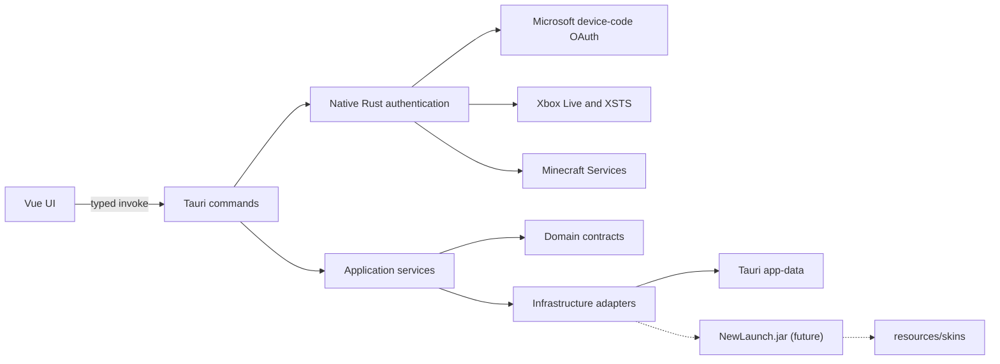

# SpringRP Launcher architecture

## Scope

The current Windows-only launcher implements its desktop interface and the
Microsoft-to-Minecraft authentication path. Minecraft distribution downloads,
version management and game process execution remain future work.

## Runtime shape



Tauri owns the native window through its `tao`/`wry` stack. On Windows, `wry`
hosts the Edge WebView2 runtime. The frontend is emitted by Vite into `dist/`
and embedded by Tauri for release builds.

## Authentication flow

The native Rust backend implements the OAuth 2.0 Device Authorization Grant
using client ID `d901c992-cb44-480a-b86d-d59b74083e04` and scopes
`XboxLive.signin offline_access`.

The backend requests a device code from Microsoft and asks the operating system
to open Microsoft's verification URL in the default browser. It polls the
Microsoft token endpoint only while that challenge remains valid, then exchanges
the resulting authorization through Xbox Live, XSTS and Minecraft Services. The
final profile request returns only the Minecraft player ID and name used by the
UI.

Tokens never cross the Tauri IPC boundary. `AuthState` retains the Minecraft
access token, optional Microsoft refresh token and authenticated profile only
in native process memory. The sign-out command clears this state. There is no
session persistence in the current authentication implementation.

## Frontend boundaries

- `src/app`: application composition and global styles.
- `src/pages`: route-level screens.
- `src/widgets`: reusable page regions.
- `src/features`: user actions and their state.
- `src/entities`: shared launcher data types.
- `src/shared/api`: the only module allowed to call Tauri `invoke`.

The frontend receives the device-code challenge and the resulting Minecraft
profile. It never receives any Microsoft, Xbox, XSTS or Minecraft access token.
It uses the profile name to fetch a rendered avatar from `mc-heads.net`; no
authentication token is included in that request. A browser-only Vite preview
degrades cleanly when the Tauri IPC bridge is unavailable.

## Backend boundaries

- `commands`: serialization and Tauri IPC entry points; no authentication
  secrets are returned from this layer.
- `auth`: device-code polling and the Microsoft/Xbox/Minecraft exchange chain.
- `application`: use-case orchestration.
- `domain`: framework-independent values and rules.
- `config`: TOML models, validation and secret wrappers for future persistent
  configuration use cases.
- `launcher`: game-launch request, result, error and port contracts.
- `infrastructure`: filesystem/TOML and Java-helper adapters.

Dependencies point inward: commands and infrastructure may use application or
domain contracts; domain code does not depend on Tauri.

## Configuration

`prefs.toml` and `session.toml` define possible runtime files under Tauri's
application-data directory. Files in `config/` document their schemas only.
The current Microsoft authentication path does not call `TomlConfigStore` and
does not persist its session to `session.toml`.

If persistent sessions are enabled later, the implementation must add operating
system credential protection, explicit retention rules, migration behavior and
updated user-facing privacy documentation before release.

## Java helper contract

The future Java adapter receives a `LaunchRequest` and produces a
`PreparedLaunch` equivalent to:

```text
<java> -jar <resource-dir>/NewLaunch.jar \
  --profile <profile-id> \
  --skins <resource-dir>/skins
```

The adapter currently validates and prepares arguments but never spawns a
process. Before enabling launch, add integrity verification for the JAR,
explicit Java discovery, lifecycle events, cancellation and redacted process
logging.

## Security defaults

- Microsoft authentication uses a public-client device flow with no embedded
  client secret.
- Authentication tokens remain in native Rust memory and are never returned to
  the Vue frontend.
- The main WebView has a restrictive content security policy.
- The main WebView capability grants only the listed Tauri core window actions;
  opening Microsoft's verification URL is initiated by the native command.
- No shell/process plugin is exposed to JavaScript.
- Runtime session and preference files are ignored by git.
- `NewLaunch.jar` and player skins are external resources, not source assets.

See the [Privacy Policy](../PRIVACY.md) for the user-facing data-handling
statement.
