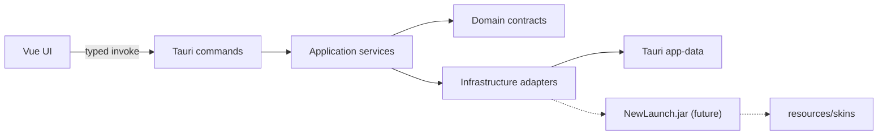

# SpringRP architecture

## Scope

The current milestone defines stable boundaries for a Windows-only launcher.
It deliberately stops before authentication, distribution downloads,
Minecraft version management and process execution.

## Runtime shape



Tauri owns the native window through its `tao`/`wry` stack. On Windows, `wry`
hosts the Edge WebView2 runtime. The frontend is emitted by Vite into `dist/`
and embedded by Tauri for release builds.

## Frontend boundaries

- `src/app`: application composition and global styles.
- `src/pages`: route-level screens.
- `src/widgets`: reusable page regions.
- `src/features`: user actions and their state.
- `src/entities`: shared launcher data types.
- `src/shared/api`: the only module allowed to call Tauri `invoke`.

The initial UI calls only `get_architecture_status`. A browser-only Vite preview
degrades cleanly when the Tauri IPC bridge is unavailable.

## Backend boundaries

- `commands`: serialization and Tauri IPC entry points; no business rules.
- `application`: use-case orchestration.
- `domain`: framework-independent values and rules.
- `config`: TOML models, validation and secret wrappers.
- `launcher`: game-launch request, result, error and port contracts.
- `infrastructure`: filesystem/TOML and Java-helper adapters.

Dependencies point inward: commands and infrastructure may use application or
domain contracts; domain code does not depend on Tauri.

## Configuration

`prefs.toml` and `session.toml` are runtime files under Tauri's app-data
directory. Files in `config/` document their schemas only. `session.toml` must
never be committed, and its token type intentionally has no `Debug`
implementation to reduce accidental logging.

Configuration is parsed into typed Rust models and validated before use.
User-facing errors should be mapped at the command boundary; low-level errors
retain their source internally without exposing secrets.

## Java helper contract

The future Java adapter receives a `LaunchRequest` and produces a
`PreparedLaunch` equivalent to:

```text
<java> -jar <resource-dir>/NewLaunch.jar \
  --profile <profile-id> \
  --skins <resource-dir>/skins
```

At this milestone, the adapter only validates and prepares arguments. It never
spawns a process. Before enabling launch, add integrity verification for the
JAR, explicit Java discovery, lifecycle events, cancellation and redacted
process logging.

## Security defaults

- The main WebView has a restrictive content security policy.
- The main capability grants only Tauri core defaults.
- No shell/process plugin is exposed to JavaScript.
- Session and preference runtime files are ignored by git.
- `NewLaunch.jar` and player skins are external resources, not source assets.
